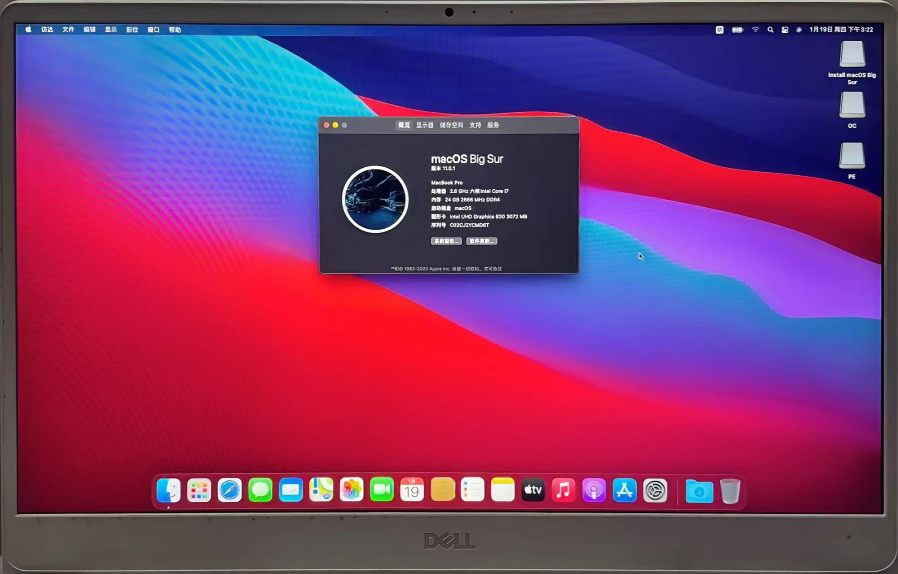

# Dell-Inspiron-7591-Hackintosh-OpenCore

# System Configuration

|Model|MacBookPro16,4|Version|Big Sur 11.0.1 20B29|
|:-|:-|:-|:-|
|Processor|i7-9750H @ 2.60 GHz|Graphics|UHD Graphics 630|
|Memory|DDR4 2666MHz 8+16GB|OS Disk|PC SN520 NVMe 512GB|
|Audio|Realtek High Definition Audio|Wi-Fi/Bluetooth|Intel AC9560|

# Introduction

- This repository is based on the work of @[Pinming](https://github.com/Pinming/Dell-Inspiron-7590-Hackintosh-Opencore). Thanks!
- OpenCore version `0.7.8`, macOS version `11.0.1 20B29`
- Add kexts support for Intel AC9560 Wireless Network Card and both of Wi-Fi and Bluetooth work. Thanks to @[zxystd](https://github.com/OpenIntelWireless/itlwm)!
- DMG IMAGE download [here](https://mp.weixin.qq.com/s/-opLKNiALPPTsPqEn__CwA)(after `Like the author`). Thanks to @[daliansky](https://github.com/daliansky/daliansky.github.io)!

# Prerequisites

- A USB with storage larger than 16 GB. The faster the better!
- Download the image [here](https://mp.weixin.qq.com/s/-opLKNiALPPTsPqEn__CwA).
- Software needed
    - [balenaEtcher](https://www.balena.io/etcher)
    - [DiskGenius](https://www.diskgenius.com/)
    - [EasyUEFI](https://sqlsec.lanzouw.com/i4amxzmj1cj)
    - [OpenCore Auxiliary Tools](https://github.com/ic005k/OCAuxiliaryTools/releases/tag/20230006). Thanks to @[ic005k](https://github.com/ic005k/)!
- Watch the instruction of this [video](https://www.bilibili.com/video/BV1854y1X7oP/?share_source=copy_web&vd_source=d8221e8cb7727e6c5e9d827db8e86d26). Thanks to @[我要鱼还要熊掌](https://space.bilibili.com/213287940)!

# Build

## 1. Prepare the EFI

1. Download the `EFI` of this repository and rename this folder to `OC`.

## 2. Prepare the USB

2. Plug in your USB.
3. Open `balenaEtcher` and then flash the USB with `.dmg` file you download.

## 3. Prepare the disk

5. Open `DiskGenius`. Find `ESP` disk of your USB and then find `EFI` folder. Delete `Clover` folder. Move `OC` to `EFI` folder of USB.
6. Prepare a disk to install macOS. You don't have to buy a new SSD. Just seperate a disk from SSD you use currently.

## 4. Set BIOS

7. Restart the computer, and **press F2** when Dell logo occurs to set the BIOS.
8. Find `General/Boot Sequence` -> Press `Add Boot Option` -> Set `Boot Option Name` to `macOS` -> Select the file `FS0/EFI/OC/OpenCore.efi` -> Select `macOS` to the head of boot sequency
9.  **Important!!** Find `Secure Boot` -> Disable the secure boot 
10. **Important!!** Find `System Configuration/SATA Operation` -> Change it from `RAID ON` to `AHCI`.

## 5. Install macOS

11. Apply and exit, and then **press F12** when Dell logo occurs to set the boot. Select `macOS` and press enter. (Actually this step is optional. When you finish the boot sequence setting in step 7, it will automatically go to OpenCore boot.)
12. Now you will see the graphical interface of OpenCore. Select `Install macOS Big Sur` and wait. (The time it takes depends on your hardware)
13. When it finishes, you will see `macOS实用工具`. Select `磁盘工具`. Find the disk you prepared previously to install macOS on. Press the button `抹掉`. Name: `macOS`, Type: `APFS`.
14. After the procedure, press the button `磁盘工具` in upper left corner and then select `退出磁盘工具`.
15. Now you will see `macOS实用工具` again. Select `安装macOS`. Just follow the instruction.
16. When it finishes, it will restart again. Press F12 and select `macOS`.
17. Now this time select `macOS Installer`. Just wait.
18. Restart again. Repeat step 15. Select `macOS` this time. Now you can follow the instruction to set the system of macOS. When you finish, you will see the Big Sur background photo.

## 6. Set the EFI of SSD

19. Restart maunally, and **press F12**, then select `Windows Boot Manager` to enter Windows system.
20. Delete the `OC` EFI you've downloaded. Open `DiskGenius`. Select the `ESP` of USB and find `EFI/OC` folder. Right click and copy it to desktop.
21. Select the `ESP` of your SSD. (HD0 by default). Enter the `EFI` folder and drag the `OC` folder on the desktop to this folder. (`EFI/OC`)
22. Open `EasyUEFI` -> Select `管理EFI启动项` -> Delete the `macOS` we set before in BIOS -> Select `Add boot option`. Type `Linux or other OS`, Name `macOS`, File `\EFI\OC\OpenCore.efi` -> Move `macOS` to the head of sequence.

## 7. Check

23. Restart the computer. Select `macOS` in OpenCore interface. If you enter the macOS system successfully, congratulations! Now you can enter Windows/macOS without the USB, and Wi-Fi/Bluetooth should work as well. Next time just select the system you want to enter in OpenCore interface.

## 8. Set RST from RAID ON to AHCI (Crutial for DELL)

24. You may encounter a problem that when you set SATA operation to AHCI, you can't enter Windows system normally and will see a blue screen. Please follow this [instruction](https://support.thinkcritical.com/kb/articles/switch-windows-10-from-raid-ide-to-ahci) to switch it from RAID ON to AHCI. After that, you can enter Windows normally in AHCI mode.

# After Installation

- There are many instructions about Hackintosh and OpenCore. I strongly recommend the instruction of @[sqlsec](https://github.com/sqlsec). You can learn it from the [website](https://apple.sqlsec.com/) or [video list](https://www.bilibili.com/video/BV1yq4y1o7cT/?share_source=copy_web&vd_source=d8221e8cb7727e6c5e9d827db8e86d26). You may encounter many problems when you use Hackintosh, and maybe you can find the solution from his instruction.
- You may need a configurator for your own OpenCore EFI. `OpenCore Configurator` and `OpenCore Auxiliary Tools` are recommended. There are many instructions on the website.
- [Hackintool](https://github.com/benbaker76/Hackintool) is another software you'll need when you use Hackintosh.
- Welcome to telegram group @[Hackintosh759x](https://t.me/Hackintosh759x) and @[inspiron759x](https://t.me/inspiron759x) to discuss about Dell Inspiron 759x and Hackintosh. You can also join @[osx86zh](https://t.me/osx86zh) to discuss about Hackintosh on PC.
- When you find problems, Google it first!
